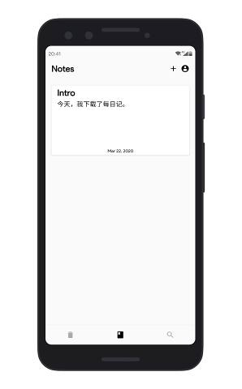
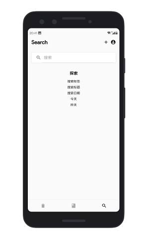
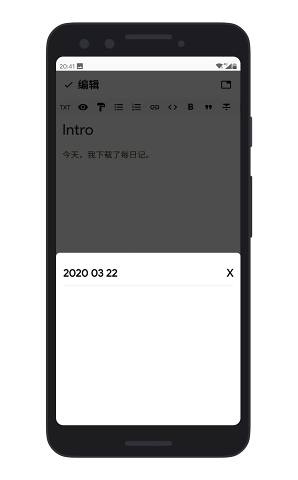
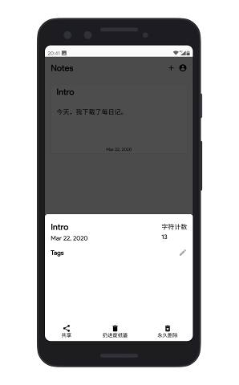
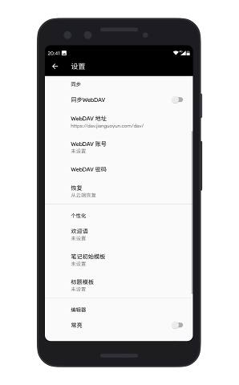

# Daily Notes

> **The project is now NOT ACTIVELY maintaine for I am no longer an Android Developer (Maybe gonna make the iOS edition). PRs and Issues are still welcome!**

> The 3.0 Version of the repo is open source whereas the older versions are not. You can still download the APKs from CoolAPK.

Hyper Notes is a Markdown Note APP written in Java with powerful features.

Download at [CoolAPK | 酷安](https://www.coolapk.com/apk/tk.louisstudio.daily_notes).

## Features

- Basic Editor
- Live Time Rendering using Javascript (3.0+)
- Multi-Tab Editing (3.0+)
- Better Searching Experience (3.0+)
- Tags (3.0+)
- WebDAV Sync
- APP Locker
- etc.

## Screenshots

## Contributions

Contributions are welcome here! Thank you so much!

## License

---
By Louis Aeilot
> [Blog](https://aeilot.github.io) · [GitHub](https://www.github.com/aeilot)
